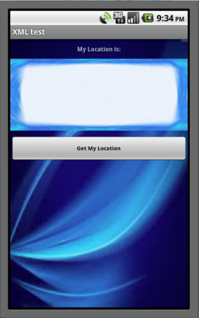
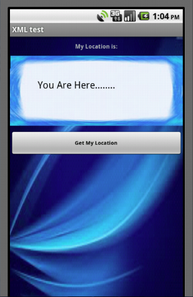
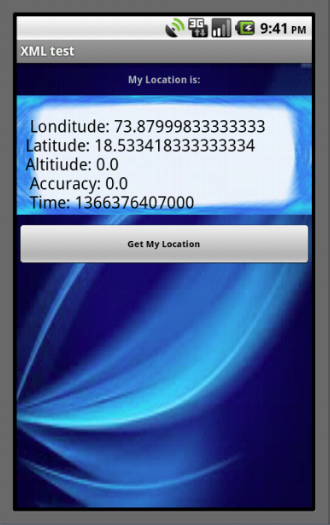
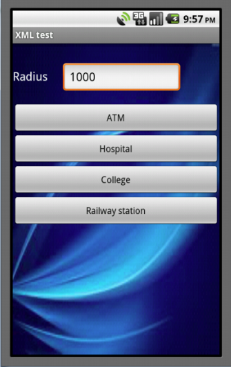
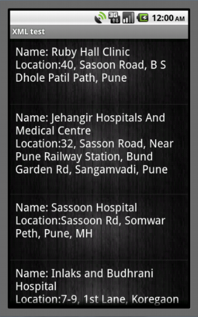

Geo Locator App
===================================

1. This app is used to get the locations of ATM, college, hospital and railway station in a specified radius of user's current location.
2. This app uses longitude and lattitude of user's current locations.
3. App ask user to enter radius around his location.
4. App finds ATM, college, hospital and railway station within the radius specified by user.

I have created this App in my Masters degree(MCA) Android course.

SCREENSHOTS:

